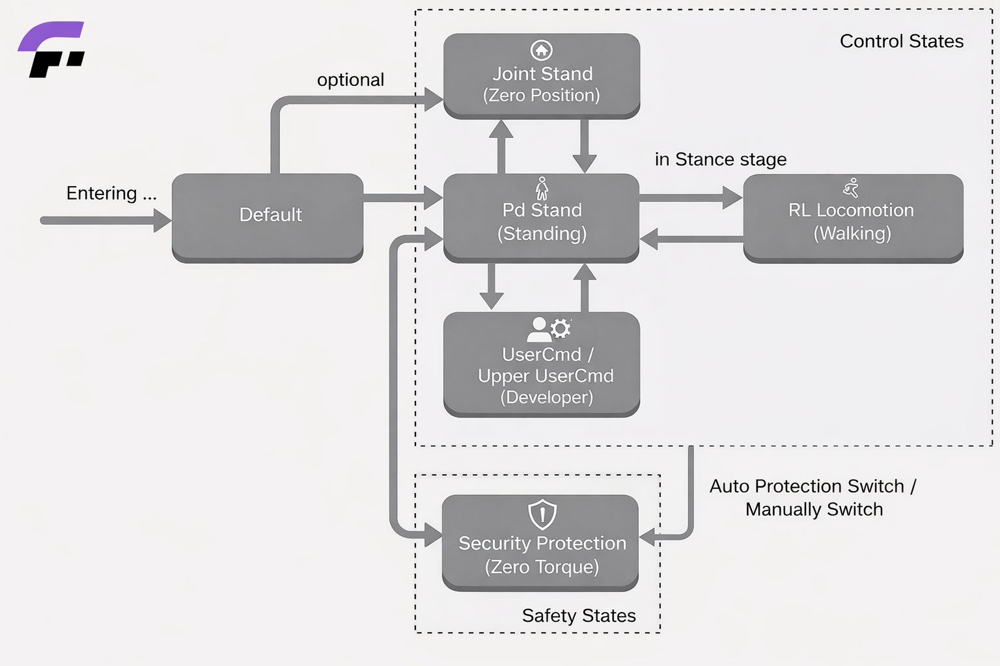

# Developer Guide

This guide is intended for developers who want to use Fourier Aurora SDK for their own applications on Fourier robots. It provides information on how you can use the SDK based on your project's needs.

Aurora runs a FSM state machine and each state corresponds to certain tasks(controllers). You can switch between these states using the joystick or by sending commands through the DDS interface. Every task has its own inputs and outputs. You can use **joystick** or **DDS** to interact with the tasks.

## State and Task Overview

Aurora provide various controllers natively, each controller is run by a task. The controllers cannot be called directly. Instead, they are wrapped in seperate states, which make sures the controllers won't overlap.



State name          | Joystick mapping | DDS mapping | Link
--------------------|------------------|-------------|-------------
Default             | LB+RB            | 0           | [Default State](controller_reference/default_state.md)
Security Protection | LT+RT            | 9           | [Security Protection State](controller_reference/security_protection_state.md)
Joint Stand         | LB+A             | 1           | [Joint Stand State](controller_reference/joint_stand_state.md)
PdStand             | LB+A             | 2           | [PdStand State](controller_reference/pd_stand_state.md)
RL Locomotion       | RB+A             | 3           | [RL Locomotion State](controller_reference/rl_locomotion_state.md)
UserCmd             | No               | 10          | [UserCmd State](controller_reference/user_cmd_state.md)
Upper UserCmd       | No               | 11          | [Upper UserCmd State](controller_reference/upper_user_cmd_state.md)

The state specification for each state is formatted as the same structure. Here's explanation on terms in state specification.

- **State Name**: Name of the state.
- **Task Name**: Name of the task, usually refers to the controller.
- **Joystick mapping**: The combination key to switch to that state using joystick.
- **DDS mapping**: The dds mapping value used to switch to that state using dds message or client.
- **Frequency**: The default frequency for the controllers in that state.
- **Avaliable for hanging**: Some controller (mostly reinforcement learning based controllers) might behave dangerous when their feets are off the ground. The section indicates whether the controllers in that state is safe for hanging.
- **Avaliable for standing**: This section indicates if the controllers in that state is able to stand on its own.
- **Auto Protection Switch**: Some controller comes with auto protection switch mechanism. When they finds themselves beyond the controllable range, they will automatically switch to security protection state. This section indicates whether controllers in that state comes with the auto protection switch mechanism.

## Fourier Aurora Client

**Fourier Aurora Client** is the Python client for Aurora. It allows you to interact with the Aurora API to retrieve data and perform actions on the Aurora platform through DDS middleware. Aurora client can be installed on the robot chest computer or any other devices to communicate with Aurora server.

For installation of fourier aurora client, please refer to quick start section (needs link).

### Client Usage

Before using fourier aurora client, please make sure **Aurora** is started. To initialze fourier aurora client, use `get_instance` function. The *domain_id* and *robot_name* arguments are mandatory for connection with Aurora. For GR-3, the *domain_id* is set to 123 by default, and *robot_name* should be "gr3". The *namespace* and *is_ros_compatible* options are reserved for future use.

At the end of the code, please use `close` funtion to apply clean up on the client.

```python
from fourier_aurora_client import AuroraClient

client = AuroraClient.get_instance(domain_id=123, robot_name="gr3", namespace=None, is_ros_compatible=False)

# execution contents here ...

client.close()
```

### State Switch Interface

Each controller state in Aurora is mapped by a *DDS mapping value*, which can be found in the table above. Developers can use `set_fsm_state` function in fourier aurora client to switch between these states and acquire current running state.

```python
client.set_fsm_state(2)     # switch to pdstand state

state = client.get_fsm_state()   # get dds mapping value for current state
```

For Rl locomotion state, its upper body controller is managed by a upper body state manager. It can be switched through `set_upper_fsm_state` function.

```python
client.set_upper_fsm_state(1)     # switch to upper act state (arm swing)

state = client.get_upper_fsm_state()   # get dds mapping value for current upper state
```

Aurora use a velocity source value to ensure only one device controls the robot's velocity. Before sending velocity commands, switch the velocity source so using `set_velocity_source`

```python
client.set_velocity_source(2)   # switch to client control

client.get_velocity_source()    # get current velocity source
```

### Control Interface

The control interfaces provided by the Fourier Aurora Client are mainly divided into two categories: robot control information acquisition interfaces and control command sending interfaces.

The robot control information acquisition interfaces are used to read the robot's current operating status and control-related data, including but not limited to key motion information such as joint angles and base velocity. These interfaces can be used under **all operating states** of the robot for status monitoring, control feedback acquisition, and support for upper-level algorithm decision-making. We provide a complete example program for obtaining robot information. Users can refer to the [Robot Information Acquisition Example](./robot_status_example.md).

The control command sending interfaces are used to send control commands to the robot, enabling direct control of the robot's motion behavior. It should be noted that the available control command interfaces differ depending on the robot's operating state. Before sending control commands, users should ensure the robot is in a state compatible with the command type. For specific interface descriptions and usage constraints, please refer to the [State and Task Overview](#state-and-task-overview) corresponding to each operating state.

For a complete description of all interfaces provided by the Fourier Aurora Client, please see the [API Documentation](../../../python/docs/EN/API_document_EN.md).
